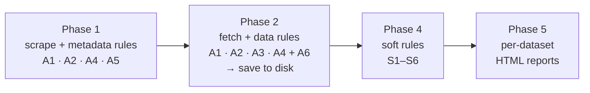
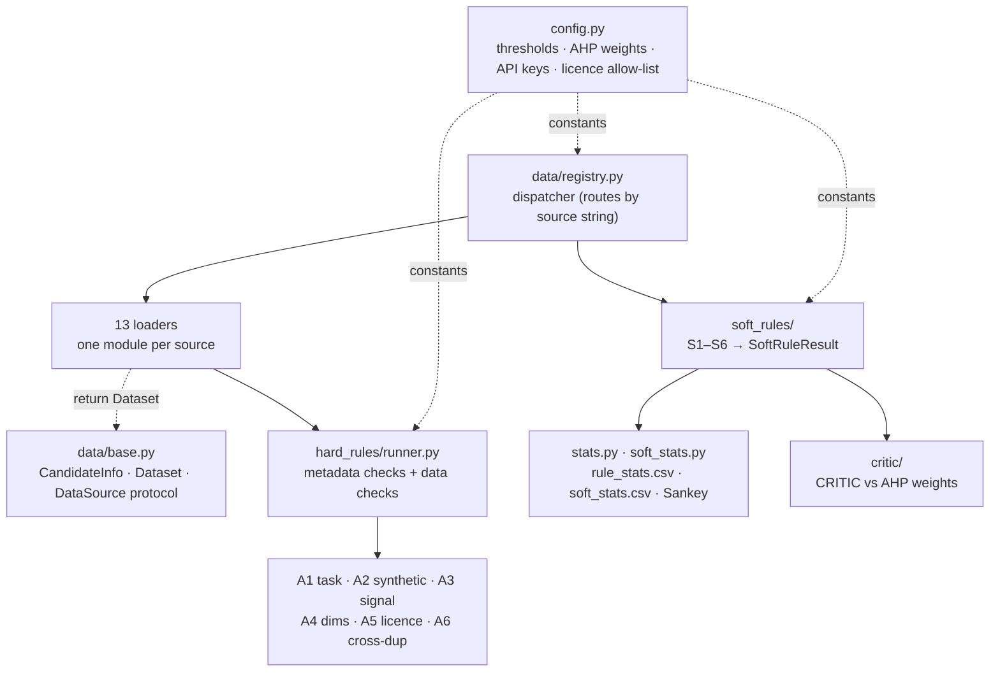
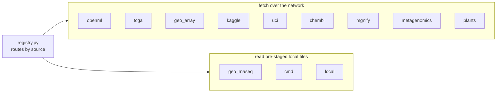
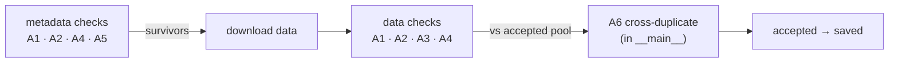
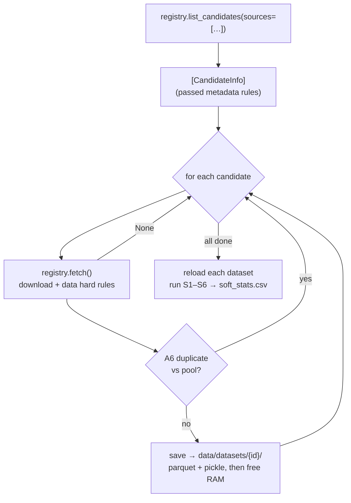

> **Status: work in progress.** This pipeline is under active development and
> contains bugs. The main curation pipeline (`python -m pipeline`) assumes a
> local environment; the GEO RNA-seq export pipeline that feeds the
> `geo_rnaseq` loader runs on the university's SLURM cluster (see the `tcml`
> branch). Expect rough edges and interfaces that may still change.

# Pipeline architecture

Automated curation of large tabular datasets for a supervised-ML benchmark.
Candidates are scraped from many sources, filtered by binary hard rules (A1–A6),
then scored by continuous soft rules (S1–S6). The soft-rule weights are checked
against an AHP baseline with the CRITIC method.

## Entry point

```bash
python -m pipeline      # runs pipeline/__main__.py
```

`__main__.py` runs the curation as logged stages (labelled Phase 1, 2, 4, 5 in
the code). Datasets are written to disk between stages, so only one is in memory
at a time.



| Phase | What happens | Output |
|-------|--------------|--------|
| 1. scrape | `registry.list_candidates()` polls every loader; each runs the cheap metadata hard rules | `CandidateInfo` list |
| 2. fetch + save | `registry.fetch()` downloads each survivor and runs the data hard rules. `__main__` then applies A6 (cross-dataset duplicate) and writes `X.parquet`, `y.parquet`, `meta.pkl` under `data/datasets/{id}/`, then frees the RAM. Caps: `MAX_SAVED_DATASETS=200` total, `MAX_PER_SOURCE_SAVED=20` per source | `rule_stats.csv` |
| 4. soft rules | every saved dataset is reloaded one at a time and scored S1–S6 (S1 first needs the pre-computed fingerprint pool) | `soft_stats.csv` |
| 5. reports | per-dataset HTML evaluation report plus `metrics.csv` (skippable via `PIPELINE_SKIP_REPORTS`) | HTML, `metrics.csv` |

## Module map



Every loader implements the same `DataSource` protocol (`list_candidates()` and
`fetch()`), so the dispatcher can route to any of them by name.

## Data sources

`registry._LOADER_MODULES` maps each `source` string to its loader module.
Loaders are imported lazily, so an unused one never loads (for example, `kaggle`
authenticates on import and would kill a headless run without creds). To add a
source, add one entry to that dict.



| Source | Loader | Access | Features | Target | Domain |
|--------|--------|--------|----------|--------|--------|
| `openml` | `openml_loader.py` | OpenML API | varies | predefined (skips `sparse_arff`) | general |
| `tcga` | `tcga_loader.py` | GDC API | expression / miRNA | sample type (tumor/normal), `vital_status` fallback | biomedical |
| `geo_array` | `geo_array_loader.py` | Entrez + GEOparse | microarray probes | built from sample text (slow scrape) | biological |
| `geo_rnaseq` | `geo_rnaseq_loader.py` | local Parquet (Nextflow export) | 29 607 genes (GRCh38) | classification column with most labels | biological |
| `kaggle` | `kaggle_loader.py` | Kaggle API (+ Croissant) | varies | heuristic detection (needs `~/.kaggle` creds) | general |
| `uci` | `uci_loader.py` | ucimlrepo | varies | predefined | general |
| `chembl` | `chembl_loader.py` | ChEMBL API | ECFP fingerprints (2048) | per-target bioactivity (regression) | biomedical |
| `metagenomics` | `metagenomics_loader.py` | MetAML markers (download) | strain markers | healthy vs one disease | biological |
| `cmd` | `cmd_loader.py` | local Parquet (curatedMetagenomicData) | MetaPhlAn taxa | healthy vs one disease | biological |
| `mgnify` | `mgnify_loader.py` | MGnify API (EBI) | IPR functional (~13 k) | auto-picked metadata field (biogeography) | biological |
| `plants` | `plants_loader.py` | Zenodo 13328785 (auto-download) | per-species gene expression (~30 k) | tissue category (leaf/root/flower), age (days) | biological |
| `local` | `local_loader.py` | reads `data/datasets/` | n/a | re-loads already-saved datasets (not an external source) | n/a |

Each loader runs its own `scrape → metadata rules → download → data rules →
Dataset` path; the dispatcher only routes. Two loaders need extra context.

`geo_rnaseq` has no live API. It reads Parquet exports (`<ACC>_X.parquet`,
`<ACC>_metadata.parquet`, `<ACC>_info.json`) produced offline by the Nextflow
RNA-seq pipeline (`rnaseq_pipeline/build_tabular.py`), scanned from `data/rnaseq/`
(set `GEO_RNASEQ_DIR` to override). That export runs on the SLURM cluster (`tcml`
branch): each GEO study is fetched from SRA, pseudo-aligned with Salmon, and
collapsed to a gene-count matrix (`P = 29 607` genes, capped at `MAX_SAMPLES`
rows). It still runs the full hard-rule chain, so small-N cohorts can fail A4
(`N ≥ MIN_ROWS = 150`).

`plants` auto-downloads the 12-species RNA-seq record (Ficklin lab) on the first
`fetch`, about 21 GB, cached to `PLANTS_DIR`. It builds one dataset per species:
6 predict age (regression, from `time_in_days`) and 6 predict tissue category
(classification, leaf/root/flower). The species-to-target split (`AGE_SPECIES`)
keeps the two targets from sharing samples and tripping A6.

## Hard rules

Two-phase: the cheap metadata checks gate the expensive downloads. A6 runs last,
in `__main__`, because it needs the growing pool of accepted datasets.



| Rule | What it does |
|------|--------------|
| A1 Task type | classification or regression; infers from the target when unknown |
| A2 Synthetic | regex on name/tags plus `make_*` sklearn generators; TCGA and GEO auto-pass |
| A3 Signal | permutation RF on adjusted balanced accuracy / R² (chance-corrected, so the floor means the same for binary, multiclass, and regression); TabPFN gives a second opinion on near-trivial signals |
| A4 Dimensions | `N ≥ MIN_ROWS` (150) and `P ≥ MIN_FEATURES` (1000), at both metadata and data level. In practice `P ≥ 1000` is the binding constraint |
| A5 Licence | normalises the string, rejects NC/ND, checks an allow-list |
| A6 Cross-duplicates | row-sort plus byte-hash; rejects if the overlap with an already-accepted dataset is above the threshold |

## Soft rules

Each rule exposes `score(dataset, …) → SoftRuleResult` with a continuous `score`
in [0, 1] (1 = clean). The AHP point tiers are for display only.

| Rule | Points | Implementation |
|------|--------|----------------|
| S1 Uniqueness | 10 | per-column moment fingerprint (mean/std/skew/kurt), cosine vs pool |
| S2 Sample duplication | 10 | strict exact-duplicate rows on `(X \| y)` via row hashing |
| S3 Data Quality | 15 | composite: completeness, consistency, outliers (IsolationForest), constant features |
| S4 Data Leakage | 20 | per-feature predictive-gap: worst vs median feature stat (Mann-Whitney / Spearman). Scores low when one feature sticks out far above the bulk (a leak), high when the signal is spread across features (biology) |
| S5 Class Balance | 5 | normalized Shannon entropy of the class distribution |
| S6 Batch Effects | – | `1 − NMI(target, batch)`: flags a target that is just a technical batch relabelled. Needs a per-sample `batch` in metadata (mgnify persists the instrument), otherwise returns 1.0. It is near-constant across the benchmark, so CRITIC drops it |
| S7 Domain-QC | – | placeholder; too domain-specific to automate generically |

S2's duplicate detection used to live inside S3 as a "uniqueness" sub-metric. It
was moved out so a duplicate row is counted once: duplicates break the IID
assumption (S2's job) and sit outside S3's cleanliness checks.

## End-to-end flow



## Key patterns

- `registry.py` sends each call to the right loader by its `source` string, so a new source is one entry in `_LOADER_MODULES`.
- Metadata checks run before data checks, so the expensive downloads only happen for candidates that already passed the cheap filters.
- Each fetched dataset is written to disk and freed before the next one, which keeps memory bounded no matter how big the cohort is.
- `runner.py` holds the rules as a plain list and loops over them, so a new rule is one line.
- Loaders all expose `list_candidates()` and `fetch()`; that shared shape is what the dispatcher depends on.
- Soft rules return a continuous `score` in [0, 1]. The point tiers exist only for display, because CRITIC needs the continuous values.

## Domain tagging

Each `CandidateInfo` and `Dataset` carries a `domain` field:

- `"biomedical"`: clinical / cancer / patient (TCGA, ChEMBL)
- `"biological"`: broader life sciences (GEO, microbiome, plants)
- `"general"`: everything else; the default for OpenML, Kaggle, UCI

For the heterogeneous sources, `data/base.py:infer_domain(name, tags,
description)` runs a keyword regex that upgrades `"general"` candidates to
biomedical or biological when the title mentions cancer, gene expression,
methylation, species, and so on.

## Visualization

`stats.build_sankey(csv_path="rule_stats.csv")` renders the hard-rule funnel as a
Sankey diagram. Each source flows `source → A1 → A2 → A3 → A4 → A5 → A6 →
Accepted` in numeric rule order, and every rule's rejections drain into one
shared `Rejected` node. Counts appear in the node labels, and it writes
`<csv>.html`. plotly is imported lazily, so the pipeline still imports without it
(`kaleido` is only needed for PDF export). A6 rejections are recorded in
`__main__` under `candidate.id`, so cross-duplicate drops show up as the final
funnel stage.

## CRITIC weight validation

`pipeline/critic/` derives objective soft-rule weights from the score matrix and
compares them to the AHP baseline. It runs separately from the main pipeline:

- `critic.py`: the CRITIC method (min-max normalize, contrast intensity, conflict, informativeness, weights). Constant columns (for example S5) carry no signal and fall back to AHP.
- `score.py`: per-dataset CRITIC scores from the weight vector.
- `calibrate.py`: weight calibration helpers.

## Testing

Quick smoke test for any loader: run `list_candidates` against the real source
and stop after the first candidate that passes the metadata hard rules. Swap
`tcga_loader` for any other (`openml_loader`, `mgnify_loader`, `cmd_loader`,
`plants_loader`, and so on). Offline loaders read local files instead of an API
(`geo_rnaseq` from `data/rnaseq/`, `cmd` from `data/cmd/`).

```bash
python -c "
import logging
logging.basicConfig(level=logging.INFO, format='%(levelname)s %(name)s: %(message)s')
from pipeline.data import tcga_loader
cands = tcga_loader.list_candidates(max_candidates=1)
print('---'); print('Got', len(cands), 'candidate(s)')
for c in cands:
    print(c.id, c.name, 'N=', c.n_samples, 'P=', c.n_features, 'task=', c.task_type)
"
```

What it does:

1. Turns on `INFO` logging so the loader's own progress lines show up.
2. Imports the loader (run from the project root so `pipeline/` is importable).
3. Calls `list_candidates(max_candidates=1)`, which stops at the first valid candidate.
4. Prints `id`, `name`, N, P and `task_type` so you can confirm the result shape.

Notes:

- `max_candidates` is the max kept after filtering, not scanned. If the first N fail hard rules, the loader keeps going.
- `geo_array` is noticeably slower (Entrez rate limits and heavier downloads), so expect a minute or two even for `max_candidates=1`.

### End-to-end test (includes `fetch`)

To also exercise the download and the data-level hard rules, chain `fetch` after
`list_candidates`:

```python
ds, results = tcga_loader.fetch(cands[0])
print(ds.X.shape, ds.y.shape, ds.task_type)
```

`fetch` downloads the full feature matrix, so use it sparingly: a large TCGA
project is hundreds of files, and `plants` pulls its whole ~21 GB record on the
first call.

### Running soft rules on already-saved datasets

If `data/datasets/` already holds datasets from a previous run, you can re-score
them without refetching. `__main__.load_dataset` handles the parquet and pickle
boilerplate, and `rglob("X.parquet")` walks any depth, so kaggle's two-level
`{owner}/{slug}/` layout works like everything else:

```python
from pathlib import Path
from pipeline.__main__ import load_dataset
from pipeline.soft_rules import s2_sample_duplication as s2

for x_path in Path("data/datasets").rglob("X.parquet"):
    ds = load_dataset(x_path.parent)
    print(ds.id, s2.score(ds).score)
```
